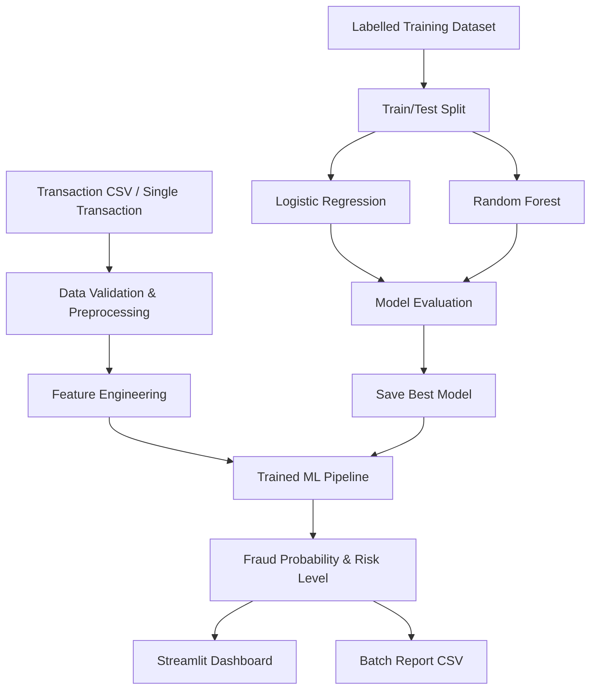

# System Architecture

```mermaid
flowchart TD
 A[Transaction CSV / Single Transaction] --> B[Data Validation & Preprocessing]
 B --> C[Feature Engineering]
 C --> D[Trained ML Pipeline]
 D --> E[Fraud Probability & Risk Level]
 E --> F[Streamlit Dashboard]
 E --> G[Batch Report CSV]
 H[Labelled Training Dataset] --> I[Train/Test Split]
 I --> J[Logistic Regression]
 I --> K[Random Forest]
 J --> L[Model Evaluation]
 K --> L
 L --> M[Save Best Model]
 M --> D
```
